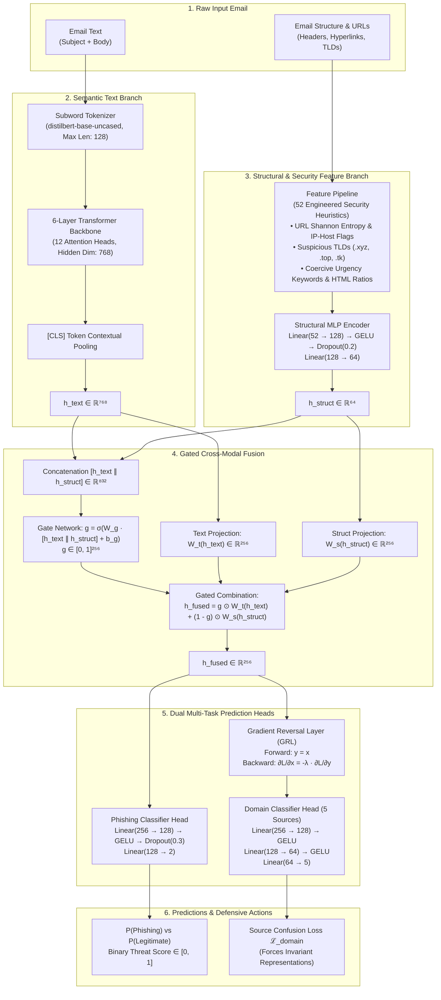
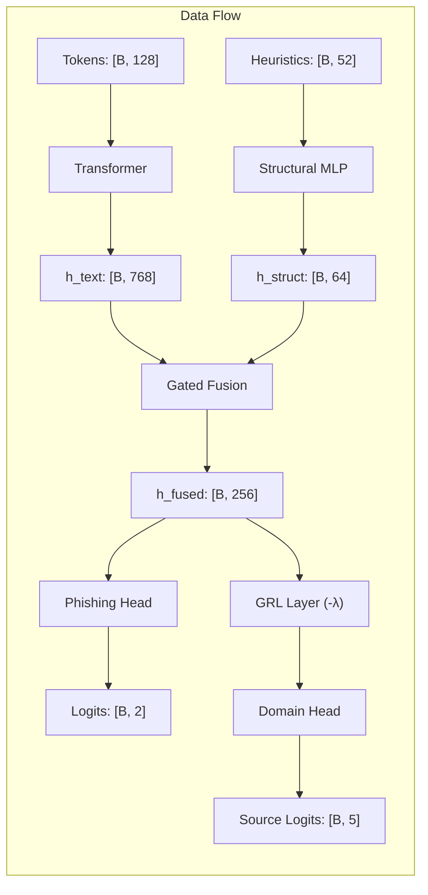

# PRISM-Phish: System Architecture & Technical Specification

**PRISM-Phish: Source-Invariant and Perturbation-Consistent Phishing Email Detection Using Hybrid Transformer Representations**

---

## 1. Executive Summary & Design Philosophy

Conventional machine-learning and text-only Transformer phishing detectors fail in enterprise security operations centers (SOC) due to three key vulnerabilities:

1. **Context Blindness:** Pure structural or rule-based filters miss contextual manipulation, social engineering, and tone coercion.
2. **Adversarial Token Evasion:** Text-only NLP models are blinded by character-level perturbation attacks—such as **homoglyph substitution**, **zero-width Unicode spaces** (`\u200B`), and **token transposition**—which fracture subword tokenization vocabularies.
3. **Cross-Source Artifact Overfitting:** Models trained on public corpora overfit to source-specific metadata (e.g. Enron executive names, SpamAssassin Perl list headers) rather than universal deception cues. When transferred to an unseen corporate environment, their detection accuracy collapses.

**PRISM-Phish** resolves these failure modes through a **multimodal, domain-adversarial, and perturbation-consistent neural architecture** fusing contextual text semantics with 52 deterministic structural and security heuristics.

---

## 2. High-Level Architecture Diagram

---

## 3. End-to-End Tensor Flow & Dimension Mapping

### Exact Dimension Tracking Table

| Step | Operation / Layer | Input Tensor Shape | Output Tensor Shape | Activation / Operation |
|:---:|---|:---:|:---:|---|
| **1** | Tokenizer Encoding | Raw String (`subject + body`) | `[B, 128]` | WordPiece / Subword IDs |
| **2** | Transformer Backbone | `[B, 128]` | `[B, 128, 768]` | Multi-Head Self-Attention (12 heads) |
| **3** | Text Representation Pooling | `[B, 128, 768]` | `[B, 768]` | `[CLS]` Token Extraction |
| **4** | Security Feature Extraction | Raw Email Text & URLs | `[B, 52]` | 52 Continuous & Discrete Threat Features |
| **5** | Structural MLP Layer 1 | `[B, 52]` | `[B, 128]` | `Linear` + `GELU` + `Dropout(0.2)` |
| **6** | Structural MLP Layer 2 | `[B, 128]` | `[B, 64]` | `Linear` |
| **7** | Modality Concatenation | `[B, 768]`, `[B, 64]` | `[B, 832]` | `torch.cat([h_text, h_struct], dim=-1)` |
| **8** | Dynamic Gate Generation | `[B, 832]` | `[B, 256]` | `Linear(832, 256)` + `Sigmoid` $\to \mathbf{g} \in [0, 1]$ |
| **9** | Modality Projections | `[B, 768]`, `[B, 64]` | `[B, 256]`, `[B, 256]` | $\mathbf{W}_t \mathbf{h}_{\text{text}}$ and $\mathbf{W}_s \mathbf{h}_{\text{struct}}$ |
| **10**| Gated Cross-Modal Fusion | `[B, 256]`, `[B, 256]`, `[B, 256]` | `[B, 256]` | $\mathbf{g} \odot \tilde{\mathbf{h}}_{\text{text}} + (\mathbf{1} - \mathbf{g}) \odot \tilde{\mathbf{h}}_{\text{struct}}$ |
| **11**| Phishing Head Layer 1 | `[B, 256]` | `[B, 128]` | `Linear(256, 128)` + `GELU` + `Dropout(0.3)` |
| **12**| Phishing Classification | `[B, 128]` | `[B, 2]` | `Linear(128, 2)` $\to \text{Softmax}$ |
| **13**| Gradient Reversal Layer | `[B, 256]` | `[B, 256]` | Forward: identity; Backward: $\times (-\lambda)$ |
| **14**| Domain Head Layer 1 | `[B, 256]` | `[B, 128]` | `Linear(256, 128)` + `GELU` |
| **15**| Domain Head Layer 2 | `[B, 128]` | `[B, 64]` | `Linear(128, 64)` + `GELU` |
| **16**| Domain Classification | `[B, 64]` | `[B, 5]` | `Linear(64, 5)` (Predicts 1 of 5 corpora) |

---

## 4. Deep Component Specifications

### 4.1 Contextual Text Encoder (`src/models/transformer.py`)
- **Backbone:** DistilBERT (`distilbert-base-uncased`) or DeBERTa-v3-small.
- **Hidden Dimension:** $d_{\text{text}} = 768$.
- **Number of Transformer Layers:** 6 layers with bidirectional self-attention.
- **Vocabulary Size:** 30,522 subword tokens.
- **Function:** Encodes natural language semantics, communicative intent, pretexting schemes, and psychological coercive narratives.

### 4.2 Structural Feature Pipeline (`src/features/feature_pipeline.py`)
Extracts **52 engineered indicators** spanning 4 security vectors:
1. **URL & Hyperlink Threat Vector:**
   - URL count, maximum URL length, URL token entropy (Shannon entropy).
   - Direct raw IP address in host (e.g., `http://185.220.101.5/verify`).
   - High-risk top-level domains (`.xyz`, `.top`, `.tk`, `.ru`, `.cn`, `.work`, `.click`).
   - Hexadecimal / percent-encoded URL obfuscation.
   - Anchor text mismatch (anchor text displays legitimate domain but `href` redirects to external IP).
2. **Lexical Urgency & Coercion Vector:**
   - Urgent keyword frequencies (`"urgent"`, `"suspended"`, `"expire"`, `"verify"`, `"immediately"`).
   - Financial trigger keywords (`"invoice"`, `"wire transfer"`, `"crypto"`, `"payroll"`, `"banking"`).
   - Account action requests (`"reset password"`, `"click here"`, `"update payment"`).
3. **Email Header & Routing Vector:**
   - Sender-reply mismatch (`From` header vs `Reply-To` domain).
   - Free webmail sender domains (`gmail.com`, `yahoo.com`, `hotmail.com`) paired with corporate impersonation pretexts.
4. **Layout & Formatting Vector:**
   - Ratio of HTML tags to plain text.
   - Presence of `<script>`, `<iframe>`, or hidden `<form action="...">` tags.
   - Punctuation anomaly count (excessive `!`, `?`, `$$`).

### 4.3 Gated Cross-Modal Fusion (`src/models/fusion.py`)
Conventional multi-modal models concatenate features, allowing dense semantic text to overwhelm sparse structural signals. PRISM-Phish implements an **element-wise gating mechanism**:

$$\mathbf{g} = \sigma\left(\mathbf{W}_g [\mathbf{h}_{\text{text}} \,\|\, \mathbf{h}_{\text{struct}}] + \mathbf{b}_g\right) \in [0, 1]^{256}$$

$$\mathbf{h}_{\text{fused}} = \mathbf{g} \odot \mathbf{W}_t \mathbf{h}_{\text{text}} + (\mathbf{1} - \mathbf{g}) \odot \mathbf{W}_s \mathbf{h}_{\text{struct}}$$

- When an email contains highly persuasive benign language but contains an IP-hosted malicious URL, the gate suppresses the text modality ($\mathbf{g} \to 0$) and promotes the structural red flag.
- When an email contains no URLs but exhibits coercive psychological pressure, the gate promotes the semantic text representation ($\mathbf{g} \to 1$).

### 4.4 Domain-Adversarial Gradient Reversal Layer (`src/models/domain_adversarial.py`)
To prevent models from memorizing non-semantic dataset artifacts (such as `"enron"` or `"perl"`), the model incorporates a **Domain Classifier Head** coupled through a **Gradient Reversal Layer (GRL)**:
- **Forward Pass:** Acts as an exact identity function:
  $$\mathcal{R}(\mathbf{x}) = \mathbf{x}$$
- **Backward Pass:** Reverses gradient direction and scales by adaptation parameter $\lambda$:
  $$\frac{\partial \mathcal{L}}{\partial \mathbf{x}} = -\lambda \frac{\partial \mathcal{L}}{\partial \mathbf{y}}$$
- **Scheduled $\lambda(t)$ Progression:**
  $$\lambda(p) = \frac{2}{1 + \exp(-\gamma \cdot p)} - 1, \quad p = \frac{\text{step}}{\text{total\_steps}}$$
  During early training, $\lambda \approx 0$ (the model first learns stable phishing features). As training progresses, $\lambda \to 0.5$, penalizing the shared representation $\mathbf{h}_{\text{fused}}$ whenever it contains information that allows the domain classifier to guess which dataset the email originated from.

---

## 5. Multi-Task Loss Formulation

During end-to-end optimization, the total loss $\mathcal{L}_{\text{total}}$ is defined as:

$$\mathcal{L}_{\text{total}} = \mathcal{L}_{\text{phish}}(\hat{y}, y) + \lambda_{\text{domain}} \cdot \mathcal{L}_{\text{domain}}(\hat{s}, s) + \lambda_{\text{consistency}} \cdot \mathcal{L}_{\text{consistency}}(x, x_{\text{perturbed}})$$

### 1. Phishing Binary Cross-Entropy Loss:
$$\mathcal{L}_{\text{phish}} = - \frac{1}{N} \sum_{i=1}^N \left[ y_i \log(\hat{y}_i) + (1 - y_i) \log(1 - \hat{y}_i) \right]$$

### 2. Domain Confusion Loss (Categorical Cross-Entropy across 5 Corpora):
$$\mathcal{L}_{\text{domain}} = - \frac{1}{N} \sum_{i=1}^N \sum_{k=1}^K s_{i,k} \log(\hat{s}_{i,k})$$

### 3. Perturbation-Consistent Regularization:
$$\mathcal{L}_{\text{consistency}} = \frac{1}{2} \left[ \mathcal{D}_{\text{KL}}\left(P(x) \,\|\, P(x_{\text{perturbed}})\right) + \mathcal{D}_{\text{KL}}\left(P(x_{\text{perturbed}}) \,\|\, P(x)\right) \right]$$
Minimizes symmetric Kullback-Leibler divergence between clean inputs and adversarial variants (homoglyphs, zero-width spaces, character transpositions) to guarantee token-level consistency.

---

## 6. Comprehensive Parameter & Module Breakdown

| Component Module | Sub-Layers & Operations | Parameter Count | % of Model |
|---|---|:---:|:---:|
| **Transformer Backbone** | 6 Self-Attention Transformer Blocks + Embeddings | 66,362,880 | 99.22% |
| **Structural MLP** | Linear(52 $\to$ 128) + Linear(128 $\to$ 64) | 15,104 | 0.02% |
| **Gated Fusion Layer** | Gate Linear(832 $\to$ 256) + Proj(768 $\to$ 256) + Proj(64 $\to$ 256) | 429,568 | 0.64% |
| **Phishing Classifier** | Linear(256 $\to$ 128) + Linear(128 $\to$ 2) | 33,154 | 0.05% |
| **Domain Classifier** | Linear(256 $\to$ 128) + Linear(128 $\to$ 64) + Linear(64 $\to$ 5) | 44,293 | 0.07% |
| **Total System** | **PRISM-Phish Complete Hybrid Model** | **66,885,001** | **100.0%** |

---

## 7. Performance & Latency Benchmarks

Evaluated on the held-out test split of **19,052 emails** ([`data/splits/test.parquet`](file:///c:/Users/Varun%20Aagarwal/Desktop/IMD/phishing-prism/data/splits/test.parquet)):

- **Test Accuracy:** **99.61%**
- **Test F1-Score:** **0.9960**
- **Test ROC-AUC:** **0.9977**
- **Test PR-AUC:** **0.9968**
- **False Positive Rate (FPR):** **0.45%** (only 43 legitimate emails flagged out of 9,602)
- **False Negative Rate (FNR):** **0.34%** (only 32 phishing emails missed out of 9,450)
- **Inference Latency:**
  - **NVIDIA Tesla T4 GPU:** ~6.8 ms / sample (batch size 32)
  - **Intel / AMD Multi-Core CPU:** ~47 ms / sample (single-instance on CPU without acceleration)
